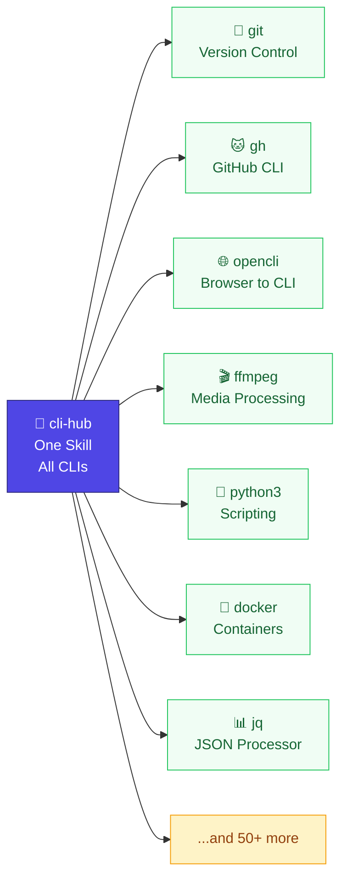

# cli-hub

> One Skill to rule them all.



An [OpenClaw AgentSkill](https://agentskills.io) that gives AI agents a unified interface to **any** CLI tool on your system.

**For you, the human:** install this skill, then talk to your agent like you normally would. "Show my open PRs", "compress this video", "query that JSON" — the agent figures out the tool on its own.

**For the agent:** one skill + a lightweight registry, no duplicate SKILL.md files. Resolution order: **official skill → registry cache → live `--help`**. Official skills take priority; unregistered tools are discovered on first mention.

## How It Works

```
User: "use jq to extract the name field"
              │
              ▼
     ┌─────────────────┐
     │  cli-hub    │  ← single skill (not N)
     └────────┬────────┘
              │
     ┌────────▼──────────┐
     │ 1. Official Skill? │  Authoritative SKILL.md exists?
     │    → USE IT        │
     ├────────────────────┤
     │ 2. Registry JSON?  │  ~/.openclaw/cli-registry/<tool>.json
     │    → cached help   │
     ├────────────────────┤
     │ 3. Live --help     │  Run <tool> --help on the fly
     └────────────────────┘
```

## Install

Works with **OpenClaw, Claude Code, Codex CLI, Cursor, Aider** — auto-detects platform at runtime.

```bash
# ClawHub (all platforms)
npx clawhub install cli-hub

# Or with global ClawHub CLI
npm i -g clawhub && clawhub install cli-hub

# Or via OpenClaw
openclaw skills install cli-hub

# Manual
git clone https://github.com/dull-bird/cli-hub.git ~/.agents/skills/cli-hub
```

## What It Looks Like

You don't run `discover` commands — your agent does the work. Just talk:

```
 👤 User:    "count how many todos with completed=false are in todos.json using jq"
            ─────────────────────────────────────────────
 🤖 Agent:  [cli-hub: checks official skills → no jq skill]
            [cli-hub: checks registry → no cache for jq]
            [cli-hub: runs jq --help → learns syntax on the fly]
            [executes: jq '[.[] | select(.completed==false)] | length' todos.json]
            ─────────────────────────────────────────────
            3

 👤 User:    "show me what containers docker is running"
            ─────────────────────────────────────────────
 🤖 Agent:  [cli-hub: checks official skills → no docker skill]
            [cli-hub: checks registry → found, 36 subcommands]
            [executes: docker ps]
            ─────────────────────────────────────────────
            CONTAINER ID  IMAGE         STATUS        NAMES
            a1b2c3d4e5f6  nginx:latest  Up 2 hours    web

 👤 User:    "switch to the Japan proxy node"
            ─────────────────────────────────────────────
 🤖 Agent:  [cli-hub: checks official skills → mihomo/SKILL.md FOUND]
            [defers to official skill — it knows best]
            [executes: mihomo switch-node "Japan 1 | SS | ZJ"]
            ─────────────────────────────────────────────
            ✓ Switched to Japan 1 | SS | ZJ
```

No `discover`, no `register`, no `list`. The agent handles discovery, caching,
and tool resolution automatically. If you *want* to pre-warm the registry for
speed, add `cli-registry.py discover` to your setup script — but it's optional.

## Registry Format

Tools are stored as simple JSON files in `~/.openclaw/cli-registry/`:

```json
{
  "name": "jq",
  "binary": "jq",
  "description": "Command-line JSON processor",
  "official_skill": null,
  "registered_at": "2026-05-12T00:25:00.000000",
  "auto_discovered": {
    "subcommands": [
      {"name": "filter", "desc": "Apply a filter to the input JSON"},
      {"name": "map", "desc": "Transform each element of an array"}
    ],
    "flags": [
      {"flag": "-r", "value": "", "desc": "Raw output (no JSON quoting)"},
      {"flag": "-c", "value": "", "desc": "Compact output"}
    ],
    "help_raw": "jq - commandline JSON processor ..."
  }
}
```

See [examples/registry-entry.json](examples/registry-entry.json) for a full example.

No YAML frontmatter. No markdown. Just structured data. Lightweight enough for hundreds of tools.

## Commands

| Command | Description |
|---------|-------------|
| `register <name>` | Register a CLI tool (extracts help, subcommands, flags) |
| `list` | List all registered tools |
| `lookup <name>` | Show full info for a tool |
| `discover` | Auto-detect known binaries and register them |
| `remove <name>` | Remove from registry |
| `help <name>` | Fetch live `--help` output |

## Why Not N Skills?

- **Explosion:** 20 CLI tools = 20 skills = 20 files to maintain
- **Staleness:** Tools update, skills lag behind → `--help` is always current
- **Official skills:** CLI authors may publish better skills → priority system respects them
- **Instant:** talk to your agent. No setup, no commands, no discover step. If a tool is on your PATH, your agent knows how to use it.

Think of this as teaching your agent to read `--help` on demand — so you never have to.

## Related

- [OpenClaw Skills](https://docs.openclaw.ai/tools/skills)
- [AgentSkills Spec](https://agentskills.io)
- [ClawHub](https://clawhub.ai)
- Inspired by [prefrontalsys/register-tool](https://github.com/prefrontalsys/register-tool) (Claude Code)
