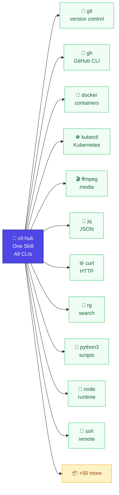

# cli-hub

> One Skill to manage every CLI tool on your system.



An [AgentSkill](https://agentskills.io) that teaches your AI agent how to use **any** CLI tool — without writing a separate skill for each one.

**The problem:** every CLI tool needs a `SKILL.md` for an agent to use it. 20 tools = 20 skills = maintenance hell.

**cli-hub replaces that with one skill.** When you say "extract JSON fields" or "check my PRs", your agent automatically finds the right tool, learns its interface, and runs the command. You never touch a config file.

## Install

```bash
npx skills add dull-bird/cli-hub
```

That's it. Works on 55+ agents including OpenClaw, Claude Code, Cursor, Gemini CLI, Copilot, Windsurf, Warp, and more.

## What It Looks Like

You talk. Your agent figures out the tool.

```
 👤  "count uncompleted todos in todos.json"
     ─────────────────────────────────────────────
 🤖  [cli-hub: search "json count filter" → jq, yq]
     [cli-hub: lookup jq → 15 commands, keyword: json,filter,transform]
     [executes: jq '[.[] | select(.completed==false)] | length' todos.json]
     ─────────────────────────────────────────────
     3

 👤  "what containers are running?"
     ─────────────────────────────────────────────
 🤖  [cli-hub: search "container running" → docker]
     [cli-hub: lookup docker → 36 commands, keyword: container,image,run]
     [executes: docker ps]
     ─────────────────────────────────────────────
     CONTAINER ID  IMAGE         STATUS       NAMES
     a1b2c3d4e5f6  nginx:latest  Up 2 hours   web

 👤  "switch to Japan proxy"
     ─────────────────────────────────────────────
 🤖  [cli-hub: mihomo/SKILL.md found → official skill]
     [defers to official skill]
     ─────────────────────────────────────────────
     ✓ Switched to Japan 1 | SS | ZJ
```

No `discover`, no `register`, no config. The agent auto-discovers tools on first mention and caches them for next time.

## How It Works

```
User says "extract JSON fields from data.json"
        │
    ┌───▼────────────────────────────┐
    │ 1. Keyword search              │  "json extract" → jq (match 2), yq (1)
    │    → asks .keywords.json       │  Finds best tool for the task
    ├────────────────────────────────┤
    │ 2. Official skill check        │  ~/.agents/skills/jq/SKILL.md?
    │    → if exists, defer to it    │  Authors know their tool best
    ├────────────────────────────────┤
    │ 3. Registry lookup             │  jq.json: binary, 15 subcommands, help
    │    → cached on first use       │  Knows exactly how to run it
    ├────────────────────────────────┤
    │ 4. Live --help (fallback)      │  jq --help → learn on the spot
    │    → if nothing cached yet     │  Self-registers for next time
    └────────────────────────────────┘
```

## Why This Beats N Skills

| N Skills approach | cli-hub approach |
|---|---|
| 20 tools = 20 files to maintain | 1 skill covers everything |
| Skills go stale when tools update | `--help` is always current |
| Adding a tool = writing a new skill | Adding a tool = saying its name |
| No discovery — you must know what exists | Agent finds tools on your PATH automatically |
| 0 keywords — "extract JSON" doesn't match `jq` | 50+ tools indexed by task keywords |

Think of it as teaching your agent to read `--help` — so you never write a SKILL.md again.

## Technical Reference

Registry entries are lightweight JSON (no YAML, no markdown frontmatter). Stored in `~/.openclaw/cli-registry/`. See [examples/registry-entry.json](examples/registry-entry.json).

| Script command | What it does |
|---|---|
| `cli-registry.py discover` | Scan PATH, register all known tools |
| `cli-registry.py list` | Show all registered tools |
| `cli-registry.py lookup <name>` | Full tool info: desc, keywords, subcommands |
| `cli-registry.py search <keyword...>` | Find tools by task (e.g. `search json filter`) |

Built-in knowledge base covers 50+ tools with hand-written descriptions and task keywords. See [scripts/cli-registry.py](scripts/cli-registry.py) for the full list.

## Related

- [AgentSkills spec](https://agentskills.io)
- [Vercel Skills](https://github.com/vercel-labs/skills) — `npx skills`
- [OpenClaw](https://docs.openclaw.ai)
- [ClawHub](https://clawhub.ai)
- Inspired by [prefrontalsys/register-tool](https://github.com/prefrontalsys/register-tool)
