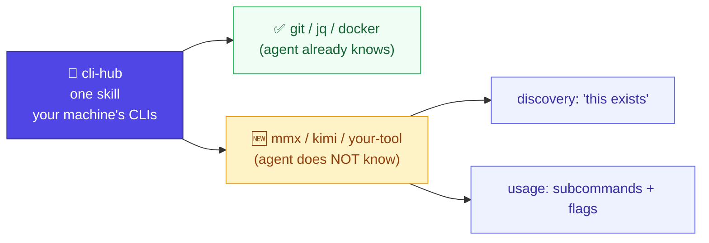

# cli-hub

> One skill so your agent can use every CLI on your machine — **including the ones it's never heard of.**

[中文版 →](README_CN.md)

Your agent knows `git` and `docker`. It does **not** know the CLI you installed
last week, or any tool released after its training cut-off — so it hallucinates
flags, guesses the wrong tool, or just gives up. cli-hub fixes that by giving the
agent a small, local registry of the tools *you actually have*, and (optionally)
pushing the right entry into its context at the right moment.



## Install

```bash
npx skills add dull-bird/cli-hub
```

Works on 55+ agents: OpenClaw, Claude Code, Cursor, Gemini CLI, Copilot, Windsurf, Warp, and more.

## Two ways it works

**1. Pull (default, every agent).** When the agent goes to use a tool, the skill
tells it to consult the local registry first — real subcommands and flags instead
of guesses. If a tool isn't registered yet, it falls back to live `--help` and
learns on the spot.

**2. Push (Claude Code, optional).** Flip it from *pull* to *automatic* so the
registry reaches the agent on its own — no reliance on it remembering:

```bash
python3 scripts/install-hooks.py        # --uninstall to remove
```

| Moment | Hook | What it injects |
|--------|------|-----------------|
| You send a message | `UserPromptSubmit` | Auto-discovers anything you've installed since last time, then injects the list of **unfamiliar** tools on *this* machine — so the agent reaches for `mmx` / your-tool instead of saying "I can't." Once per session. |
| Right before a command runs | `PreToolUse(Bash)` | The **usage** (subcommands/flags) of any unfamiliar tool in that command. Once per tool per session. |

Both hooks are non-blocking (they only add context) and only fire for tools the
model **doesn't already know** — `git`, `docker`, `jq` cost zero context. Once a
day the session pass also refreshes drifted versions and notes which tools have an
**official skill** installed, so the agent prefers the richer skill when one exists.

## Quick start

```bash
S=~/.agents/skills/cli-hub/scripts/cli-registry.py   # path varies by agent

python3 $S discover                  # scan PATH, register what's there
python3 $S flag mmx                  # mark a tool the model doesn't know
python3 $S non-standard              # preview the discovery manifest
python3 ~/.agents/skills/cli-hub/scripts/install-hooks.py   # (Claude Code) go automatic
```

Or just talk to your agent: *"scan my system and register my CLI tools"*,
*"flag mmx and kimi so you know they exist"*.

> 💡 The discovery list is built from **your** machine. cli-hub ships knowing
> nothing about which tools you run. With the hooks installed, tools you install
> under `$HOME` are surfaced automatically; otherwise you decide with `flag`.

## Commands

| Command | Use |
|---------|-----|
| `discover` | Scan PATH; register known + quality-filtered tools |
| `list` | List registered tools |
| `lookup <name>` | Full info: description, keywords, subcommands, flags, help |
| `search <kw...>` | Find a tool by task (e.g. `search json extract`) |
| `non-standard` | List installed tools the model likely doesn't know (the manifest) |
| `autodiscover` | Register only *newly-appeared* PATH tools; auto-surface user-installed ones |
| `flag <name> [--off]` | Mark / unmark a tool as novel (surface it) |
| `register <name> [--novel] [--desc "…"]` | Register a tool; `--novel` surfaces it |
| `hint <name>` | Compact usage hint for one novel tool (used by hooks) |
| `skills-check [<name>] [--search]` | Note whether an official skill is installed for a tool (prefer it) |
| `check-stale [--novel] [--update]` | Detect / refresh tools whose version drifted (keeps curated desc) |
| `remove <name>` | Remove from registry |

## Design principles

- **The registry is the database.** cli-hub never fetches anything at runtime; the
  hooks and lookups only read local JSON. Zero network.
- **"Novel" is opt-in, never inferred.** A raw PATH scan registers hundreds of
  system binaries — so a tool only surfaces if you `flag` it (or it carries a
  built-in `novel` mark). No noise.
- **Ships no opinion about you.** No hardcoded list of *your* tools, and no bound
  search engine. The product only *stores* descriptions; *researching* them is the
  agent's job, with whatever tools and knowledge it has.
- **Defers to official skills.** If `~/…/skills/<tool>/SKILL.md` exists, cli-hub
  steps aside — the author knows their tool best.

## Building accurate entries (research recipe)

Auto-extracted `--help` summaries are often vague or wrong. To curate a real
description — provider-agnostic, no specific search engine assumed:

1. **Read the tool** — `<tool> --help`, `<tool> --version`.
2. **Confirm identity / version / name collisions from the package manager**
   (`npm view <pkg>`, `curl https://pypi.org/pypi/<pkg>/json`). Many binary names
   collide — `codex` is also an unrelated docs generator, `kimi` an npm state
   library — so record what the tool is **not**.
3. **Fill in purpose** with any web search you have, or the agent's own knowledge.
4. **Store it:** `register <tool> --novel --desc "<package/vendor> — <what>. NOT <collision>."`

## Benchmarks

Claude Code + DeepSeek V4 Pro, one-shot mode. Same model, same machine. Only
difference: cli-hub installed or fully removed. [Reproducible script →](tests/benchmarks/v2/run.sh)

### AI-native tools (mmx, opencli, kimi)

These post-date Claude's training data. Without cli-hub, V4 Pro guesses wrong every time.

| # | Task | With cli-hub | Without cli-hub |
|---|------|-------------|-----------------|
| A1 | generate a cat image with mmx | ✅ `mmx image generate` | ❌ "not sure what mmx is" |
| A4 | generate text with mmx | ✅ `mmx text` | ❌ thought mmx = **Mermaid** |
| A5 | TTS with mmx | ✅ `mmx speech` | ❌ ran macOS `say` instead |
| A6 | list opencli adapters | ✅ `opencli list` | ❌ `which opencli` → not found |
| A8 | scrape bilibili via opencli | ✅ `opencli …` | ❌ fell back to curl + API |

| Metric | With | Without |
|--------|------|---------|
| Correct tool identified | **8/8 (100%)** | 0/8 (0%) |
| Hallucinated / wrong | 0/8 (0%) | **8/8 (100%)** |

Common & niche Unix tools: no difference — Claude already knows them. [→ results](tests/benchmarks/results/)

## Architecture (developers)

### Registry entry

```json
{
  "name": "mmx",
  "description": "MiniMax CLI (npm mmx-cli) — image/video/music/speech/text + web search. NOT Intel MMX.",
  "surface": true,
  "keywords": ["ai", "minimax", "generate", "image", "video"],
  "auto_discovered": {
    "version": "1.0.16",
    "usage": "mmx <resource> <command> [flags]",
    "commands_text": "image — generate\nvideo — generate, download\n…",
    "help_raw": "(cleaned --help, ≤5000 chars)",
    "subcommands": { "image": {…}, "video": {…} }
  }
}
```

`surface: true` (set by `flag` / `register --novel`) is what puts a tool in the
discovery manifest. The registry lives at `~/.openclaw/cli-registry` by default;
override with `CLI_HUB_REGISTRY`, or it auto-detects the host agent's directory.

### Decision flow

```
Use a CLI tool
   1. Official skill?      ~/…/skills/<tool>/SKILL.md → defer
   2. Registered?         lookup → description, subcommands, flags
   3. Task, no tool named? search "json extract" → jq
   4. Nothing cached?     live --help → learn + auto-register
```

### Version tracking

```bash
python3 cli-registry.py check-stale          # tools whose installed ≠ registered version
python3 cli-registry.py check-stale --update # re-register them
```

## Related

- [AgentSkills spec](https://agentskills.io)
- [Vercel Skills](https://github.com/vercel-labs/skills) — `npx skills`
- Inspired by [prefrontalsys/register-tool](https://github.com/prefrontalsys/register-tool)
