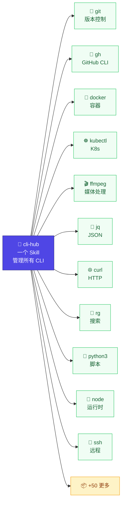

# cli-hub

> 一个 Skill 管所有 CLI。



一个 [AgentSkill](https://agentskills.io)，教会你的 AI Agent 使用**任何** CLI 工具——不用为每个工具写单独的 Skill。

**痛点：** 每个 CLI 工具都要一个 `SKILL.md`，Agent 才会用。20 个工具 = 20 个 Skill = 维护噩梦。

**cli-hub 用一个 Skill 搞定全部。** 你说"提取 JSON 字段""看看我的 PR"，Agent 自动找工具、学接口、执行命令。你什么配置文件都不用碰。

## 安装

```bash
npx skills add dull-bird/cli-hub
```

一行搞定。兼容 55+ 个 Agent 平台：OpenClaw、Claude Code、Cursor、Gemini CLI、Copilot、Windsurf、Warp 等。

## 实际效果

你说话，Agent 干活。

```
 👤  "统计 todos.json 里未完成的数量"
     ─────────────────────────────────────────────
 🤖  [cli-hub: 搜索 "json count filter" → jq, yq]
     [cli-hub: 查 jq → 15 条命令, 关键词: json,filter,transform]
     [执行: jq '[.[] | select(.completed==false)] | length' todos.json]
     ─────────────────────────────────────────────
     3

 👤  "看看 docker 在跑什么容器"
     ─────────────────────────────────────────────
 🤖  [cli-hub: 搜索 "container running" → docker]
     [cli-hub: 查 docker → 36 条命令, 关键词: container,image,run]
     [执行: docker ps]
     ─────────────────────────────────────────────
     CONTAINER ID  IMAGE         STATUS       NAMES
     a1b2c3d4e5f6  nginx:latest  Up 2 hours   web

 👤  "切到日本节点"
     ─────────────────────────────────────────────
 🤖  [cli-hub: mihomo/SKILL.md 存在 → 官方 Skill]
     [交给官方 Skill 处理]
     ─────────────────────────────────────────────
     ✓ 已切换到 日本 1 | SS | ZJ
```

不需要 `discover`、不需要 `register`、不需要配置。Agent 首次提到工具时自动发现，之后缓存复用。

## 工作原理

```
用户说 "把 data.json 里的字段提取出来"
        │
    ┌───▼────────────────────────────┐
    │ 1. 关键词搜索                   │  "json extract" → jq(匹配2项), yq(1项)
    │    → 查 .keywords.json         │  找到最合适的工具
    ├────────────────────────────────┤
    │ 2. 检查官方 Skill               │  ~/.agents/skills/jq/SKILL.md 存在？
    │    → 有则交给他                │  作者最懂自己的工具
    ├────────────────────────────────┤
    │ 3. 查注册表                     │  jq.json: 二进制路径, 15个子命令, help
    │    → 首次使用后缓存             │  知道怎么调用
    ├────────────────────────────────┤
    │ 4. 现场 --help（后备）          │  jq --help → 当场学习
    │    → 什么都没缓存时             │  顺手注册，下次直接用
    └────────────────────────────────┘
```

## 为什么比 N 个 Skill 好

| N 个 Skill 的做法 | cli-hub 的做法 |
|---|---|
| 20 个工具 = 20 个文件要维护 | 1 个 Skill 全搞定 |
| 工具更新后 Skill 过时 | `--help` 永远最新 |
| 加一个工具 = 写一个新 Skill | 加一个工具 = 说它的名字 |
| 不知道系统里有什么，靠猜 | Agent 自己扫描 PATH 发现 |
| 0 关键词 — "提取 JSON" 找不到 jq | 50+ 工具内建任务关键词索引 |

简单说：教 Agent 读 `--help`，从此告别手写 SKILL.md。

## 技术参考

注册表是轻量 JSON（非 YAML，非 Markdown），存在 `~/.openclaw/cli-registry/`。示例见 [examples/registry-entry.json](examples/registry-entry.json)。

| 脚本命令 | 说明 |
|---|---|
| `cli-registry.py discover` | 扫描 PATH，注册所有已知工具 |
| `cli-registry.py list` | 列出所有已注册工具 |
| `cli-registry.py lookup <name>` | 查看工具详情：描述、关键词、子命令 |
| `cli-registry.py search <关键词...>` | 按任务搜索工具（如 `search json filter`） |

内建知识库覆盖 50+ 工具，含手写描述和任务关键词。完整列表见 [scripts/cli-registry.py](scripts/cli-registry.py)。

## 相关链接

- [AgentSkills 规范](https://agentskills.io)
- [Vercel Skills](https://github.com/vercel-labs/skills) — `npx skills`
- [OpenClaw](https://docs.openclaw.ai)
- [ClawHub](https://clawhub.ai)
- 灵感来源：[prefrontalsys/register-tool](https://github.com/prefrontalsys/register-tool)
