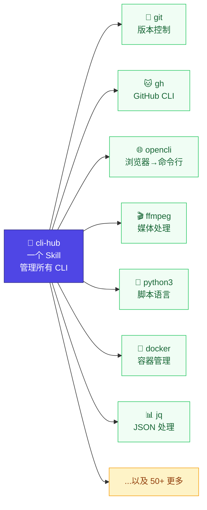

# cli-hub

> 一个 Skill 管所有 CLI。



一个 [OpenClaw AgentSkill](https://agentskills.io)，让 AI Agent 用统一接口操作**任何**系统里的 CLI 工具。

**对你来说：** 装好这个 Skill，然后像平时一样跟 Agent 说话。"帮我看看 open 的 PR""压缩这个视频""查一下 JSON 里某个字段"——Agent 自己会找工具、学用法。

**对 Agent 来说：** 一个 Skill + 轻量注册表，不用为每个工具写单独的 SKILL.md。查询顺序：**官方 Skill → 注册表缓存 → 现场 `--help`**。官方 Skill 永远优先，没注册的工具首次提到就自动发现。

## 工作原理

```
用户: "用 jq 提取 name 字段"
              │
              ▼
     ┌─────────────────┐
     │  cli-hub    │  ← 只有一个 Skill
     └────────┬────────┘
              │
     ┌────────▼──────────┐
     │ 1. 官方 Skill？    │  ~/.agents/skills/<tool>/SKILL.md 存在？
     │    → 优先使用      │
     ├────────────────────┤
     │ 2. 注册表 JSON？   │  ~/.openclaw/cli-registry/<tool>.json
     │    → 缓存的 help   │
     ├────────────────────┤
     │ 3. 现场 --help     │  跑 <tool> --help 当场学
     └────────────────────┘
```

## 安装

兼容 **OpenClaw、Claude Code、Codex CLI、Cursor、Aider** — 运行时自动检测平台。

```bash
# ClawHub（全平台通用）
npx clawhub install cli-hub

# 或全局安装 ClawHub CLI
npm i -g clawhub && clawhub install cli-hub

# 或通过 OpenClaw
openclaw skills install cli-hub

# 手动安装
git clone https://github.com/dull-bird/cli-hub.git ~/.agents/skills/cli-hub
```

## 实际效果

你什么都不用敲，Agent 干活：

```
 👤 用户:     "用 jq 把 todos.json 里 completed=false 的筛选出来统计数量"
             ─────────────────────────────────────────────
 🤖 Agent:   [cli-hub: 查官方 Skill → 无 jq 专属 Skill]
             [cli-hub: 查注册表 → 暂无 jq 缓存]
             [cli-hub: 跑 jq --help → 现场学习语法]
             [执行: jq '[.[] | select(.completed==false)] | length' todos.json]
             ─────────────────────────────────────────────
             3

 👤 用户:     "帮我看看 docker 都在跑什么容器"
             ─────────────────────────────────────────────
 🤖 Agent:   [cli-hub: 查官方 Skill → 无 docker 专属 Skill]
             [cli-hub: 查注册表 → 找到, 36 个子命令]
             [执行: docker ps]
             ─────────────────────────────────────────────
             CONTAINER ID  IMAGE         STATUS        NAMES
             a1b2c3d4e5f6  nginx:latest  Up 2 hours    web

 👤 用户:     "切到日本节点"
             ─────────────────────────────────────────────
 🤖 Agent:   [cli-hub: 查官方 Skill → mihomo/SKILL.md 存在!]
             [交给官方 Skill → 它最懂]
             [执行: mihomo switch-node "日本 1 | SS | ZJ"]
             ─────────────────────────────────────────────
             ✓ 已切换到 日本 1 | SS | ZJ
```

不需要 `discover`，不需要 `register`，不需要 `list`。Agent 自己搞定发现、缓存、工具匹配。如果你追求极致速度，可以在环境初始化脚本里加一行 `cli-registry.py discover` 预热——但完全不必要。

## 注册表格式

工具以简单 JSON 存在 `~/.openclaw/cli-registry/`：

```json
{
  "name": "jq",
  "binary": "jq",
  "description": "JSON 处理器",
  "official_skill": null,
  "auto_discovered": {
    "subcommands": [
      {"name": "filter", "desc": "Apply a filter to the input JSON"},
      {"name": "map", "desc": "Transform each element of an array"}
    ],
    "flags": [
      {"flag": "-r", "desc": "Raw output (no JSON quoting)"},
      {"flag": "-c", "desc": "Compact output"}
    ],
    "help_raw": "jq - commandline JSON processor ..."
  }
}
```

不用 YAML，不用 markdown。纯粹的机器可读数据，几百个工具也毫无压力。

完整示例见 [examples/registry-entry.json](examples/registry-entry.json)。

## 命令一览

| 命令 | 说明 |
|------|------|
| `register <name>` | 注册 CLI 工具（自动提取 help、子命令、参数） |
| `list` | 列出所有已注册工具 |
| `lookup <name>` | 查看工具详细信息 |
| `discover` | 自动扫描已知路径并注册 |
| `remove <name>` | 从注册表移除 |
| `help <name>` | 实时获取 `--help` 输出 |

## 为什么不写 N 个 Skill？

- **爆炸：** 20 个 CLI = 20 个 Skill 文件，维护成本太高
- **过时：** 工具更新后 Skill 滞后 → `--help` 永远是最新的
- **官方优先：** CLI 作者可能推出更好的官方 Skill → 优先级机制自动适配
- **即时可用：** 跟 Agent 说话就行。不用配置，不用 discover，不用任何命令。工具在 PATH 里，Agent 就会用。

可以理解为教 Agent 现场读 `--help`——所以你永远不需要手动维护工具列表。

## 相关链接

- [OpenClaw Skills 文档](https://docs.openclaw.ai/tools/skills)
- [AgentSkills 规范](https://agentskills.io)
- [ClawHub](https://clawhub.ai)
- 灵感来源：[prefrontalsys/register-tool](https://github.com/prefrontalsys/register-tool)（Claude Code 版）
