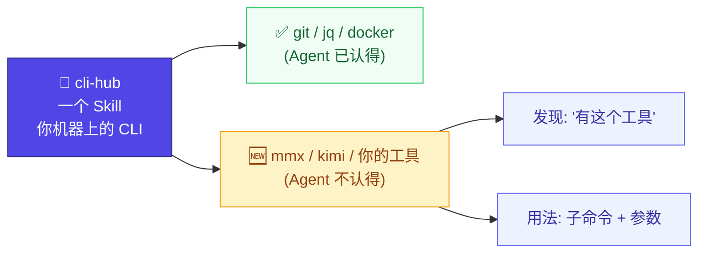

# cli-hub

> 一个 Skill，让 Agent 会用你机器上**每一个** CLI —— **包括它从没听说过的那些。**

[English →](README.md)

Agent 认得 `git`、`docker`，但它**不认得**你上周刚装的那个 CLI，也不认得任何在它训练
截止之后发布的工具——于是它瞎编参数、猜错工具、或者干脆放弃。cli-hub 的办法：给 Agent
一个本地小注册表，记录**你真正拥有的**工具；并且（可选）在恰当的时机把对应条目**主动塞进**
它的上下文。



## 安装

```bash
npx skills add dull-bird/cli-hub
```

兼容 55+ Agent：OpenClaw、Claude Code、Cursor、Gemini CLI、Copilot、Windsurf、Warp 等。

## 两种工作方式

**1. 拉取（默认，所有 Agent）。** Agent 要用某个工具时，Skill 让它先查本地注册表——
拿到真实的子命令和参数，而不是猜。工具还没注册，就退化为现场 `--help` 当场学。

**2. 推送（Claude Code，可选）。** 从"拉取"切到"自动"，让注册表主动找上 Agent——
不依赖它记得去查：

```bash
python3 scripts/install-hooks.py        # 卸载用 --uninstall
```

| 时机 | Hook | 注入什么 |
|------|------|---------|
| 你发消息时 | `UserPromptSubmit` | 先自动发现你新装的工具，再注入本机那些**它不认得**的工具清单——于是它会去掏 `mmx`/你的工具，而不是说"我不行"。每会话一次。 |
| 命令执行前 | `PreToolUse(Bash)` | 命令里那个陌生工具的**用法**（子命令/参数）。每工具每会话一次。 |

两个 hook 都是非阻塞的（只加上下文），且只对**模型不认识**的工具触发——
`git`、`docker`、`jq` 零开销。每天一次，会话还会顺手刷新漂移的版本、并标记哪些工具
装了**官方 skill**，让 Agent 在有更专业的 skill 时优先用它。

## 快速上手

```bash
S=~/.agents/skills/cli-hub/scripts/cli-registry.py   # 路径随 Agent 而变

python3 $S discover                  # 扫 PATH，注册已有工具
python3 $S flag mmx                  # 标记一个模型不认识的工具
python3 $S non-standard              # 预览发现清单
python3 ~/.agents/skills/cli-hub/scripts/install-hooks.py   # (Claude Code) 开启自动模式
```

或者直接对 Agent 说：*"扫描我的系统，注册我的 CLI 工具"*、*"把 mmx 和 kimi 标记一下，让你知道它们存在"*。

> 💡 发现清单来自**你自己的**机器。cli-hub 出厂时对你用什么工具一无所知。
> 装了 hook 后，你在 `$HOME` 下新装的工具会自动浮现；否则由你用 `flag` 决定。

## 命令

| 命令 | 用途 |
|------|------|
| `discover` | 扫 PATH，注册已知 + 质量过滤后的工具 |
| `list` | 列出已注册工具 |
| `lookup <名称>` | 完整信息：描述、关键词、子命令、参数、help |
| `search <关键词>` | 按任务找工具（如 `search json extract`） |
| `non-standard` | 列出模型可能不认识的已装工具（发现清单） |
| `autodiscover` | 只注册**新出现**的 PATH 工具；自动浮现用户安装的 |
| `flag <名称> [--off]` | 标记/取消标记某工具为 novel（浮现它） |
| `register <名称> [--novel] [--desc "…"]` | 注册工具；`--novel` 浮现它 |
| `hint <名称>` | 某 novel 工具的精简用法提示（hook 使用） |
| `skills-check [<名称>] [--search]` | 标记某工具是否装了官方 skill（有则优先用） |
| `check-stale [--novel] [--update]` | 检测/刷新版本漂移的工具（保留实证描述） |
| `remove <名称>` | 从注册表移除 |

## 设计原则

- **注册表就是数据库。** cli-hub 运行时从不联网；hook 和查询只读本地 JSON。零网络。
- **"novel" 是显式标记，绝不靠推断。** 裸扫 PATH 会注册几百个系统二进制——所以一个工具
  只有你 `flag` 了（或它自带 `novel` 标记）才会浮现。零噪音。
- **不夹带对你的任何预设。** 不预埋**你的**工具清单，也不绑定任何搜索引擎。产品只负责
  *存* 描述；*查* 描述是 Agent 的事，用它手上任何工具和知识。
- **让位给官方 Skill。** 若 `~/…/skills/<tool>/SKILL.md` 存在，cli-hub 自动退让——
  作者最懂自己的工具。

## 严格建库（调研配方）

自动从 `--help` 提取的摘要常常含糊甚至错误。要整理一条真实描述——provider-agnostic，
不假设任何特定搜索引擎：

1. **读工具本身** —— `<tool> --help`、`<tool> --version`。
2. **用包管理器核身份/版本/重名**（`npm view <包>`、`curl https://pypi.org/pypi/<包>/json`）。
   很多二进制名会撞车——`codex` 还是个无关的文档生成器、`kimi` 还是个 npm 状态机库——
   所以要记下它**不是**什么。
3. **补"用途"** —— 用你手上任何网页搜索，或 Agent 自身知识。
4. **存进去：** `register <tool> --novel --desc "<包名/厂商> — <用途>. NOT <撞名>."`

## 实测对比

Claude Code + DeepSeek V4 Pro，一次性模式。同一模型，同一机器。唯一区别：cli-hub 装或删。
[可复现脚本 →](tests/benchmarks/v2/run.sh)

### AI 原生工具（mmx, opencli, kimi）

这些工具在 Claude 训练数据截止之后才出现。没有 cli-hub，V4 Pro 每次都猜错。

| # | 任务 | 有 cli-hub | 无 cli-hub |
|---|------|-----------|-----------|
| A1 | mmx 生成猫图片 | ✅ `mmx image generate` | ❌ "不确定 mmx 是什么" |
| A4 | mmx 生成文本 | ✅ `mmx text` | ❌ 以为 mmx = **Mermaid** |
| A5 | mmx TTS 声音 | ✅ `mmx speech` | ❌ 跑去调 macOS `say` |
| A6 | opencli 列出适配器 | ✅ `opencli list` | ❌ `which opencli` 找不到 |
| A8 | opencli 抓取 bilibili | ✅ `opencli …` | ❌ 退化为 curl + API |

| 指标 | 有 | 无 |
|------|----|----|
| 正确识别工具 | **8/8 (100%)** | 0/8 (0%) |
| 幻觉/错误 | 0/8 (0%) | **8/8 (100%)** |

常见及冷门 Unix 工具：没有区别——Claude 训练数据里都有。[→ 结果](tests/benchmarks/results/)

## 架构（开发者视角）

### 注册表条目

```json
{
  "name": "mmx",
  "description": "MiniMax CLI (npm mmx-cli) — 图/视频/音乐/语音/文本 + 联网搜索. NOT Intel MMX.",
  "surface": true,
  "keywords": ["ai", "minimax", "generate", "image", "video"],
  "auto_discovered": {
    "version": "1.0.16",
    "usage": "mmx <resource> <command> [flags]",
    "commands_text": "image — generate\nvideo — generate, download\n…",
    "help_raw": "(清洗后的 --help, ≤5000 字符)",
    "subcommands": { "image": {…}, "video": {…} }
  }
}
```

`surface: true`（由 `flag` / `register --novel` 设置）决定一个工具是否进入发现清单。
注册表默认在 `~/.openclaw/cli-registry`；可用 `CLI_HUB_REGISTRY` 覆盖，或自动探测当前 Agent 目录。

### 决策流程

```
要用某个 CLI 工具
   1. 有官方 Skill?      ~/…/skills/<tool>/SKILL.md → 让位
   2. 已注册?           lookup → 描述、子命令、参数
   3. 只给了任务没给名?  search "json extract" → jq
   4. 什么都没缓存?      现场 --help → 学习 + 自动注册
```

### 版本追踪

```bash
python3 cli-registry.py check-stale          # 已装版本 ≠ 注册版本的工具
python3 cli-registry.py check-stale --update # 重新注册它们
```

## 相关链接

- [AgentSkills 规范](https://agentskills.io)
- [Vercel Skills](https://github.com/vercel-labs/skills) — `npx skills`
- 灵感来源：[prefrontalsys/register-tool](https://github.com/prefrontalsys/register-tool)
